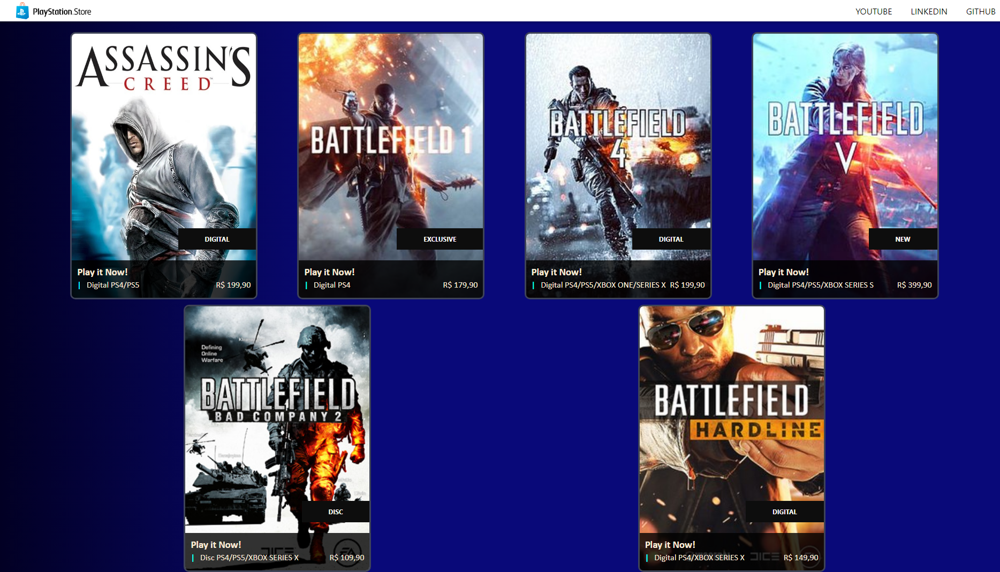

# PSN STORE CLONE

Angular Playstation Store project, used to gain experience and practice some language concepts like componetization, structuration, refactoration, code reuse and syntaxes.

# Project Photo

Each card is rendered from an array of objects containing the infos about each one dinamically
